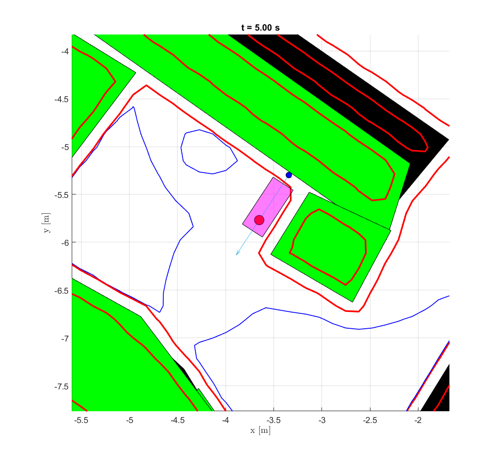

# parking-reachability

## Overview

This repository contains MATLAB scripts for reachability analysis by Team 1 in EL2425 course, HT21. For more details, please refer to the documentation of our project.

## Dependencies

The scripts are tested on MATLAB 2020b (Windows 10), with some dependencies listed below. 

Download these libraries and **add the path** of them in MATLAB.

[ToolboxLS](https://www.cs.ubc.ca/~mitchell/ToolboxLS/)

[helperOC](https://github.com/HJReachability/helperOC
) 

[YAMLMatlab](https://code.google.com/archive/p/yamlmatlab/downloads) (ver 0.4.3)

## Usage

### Setup your task

To perform reachability analysis, just run the main script `main.m`. But before running the code, you must provide map and obstacles data and probably tune some parameters in two scripts `param.m` and `parking_param.m`.

First you need to put map yaml file and obstacles yaml file in folder `data`, then you modify the names of files in `param.m` as below.

    taskPath = 'park_task2.yaml';  % obstacles
    mapPath = 'obstacles.yaml';    % map

Note that the path of folder `data` has been added in the main script, thus, only the names of yaml files are needed.

The parameters in `param.m` can be tuned. They are consistent for different parking jobs in the yaml file. It contains something like the vehicle's size, plot settings, and simulation time length.

Some parameters in `parking_param.m` are different for different jobs, depending on that it is forward/ backward/ parallel parking, and you need not care. But some other parameters can be tuned:

    rSpot = 0.05;        % distance tolerance of parking spot
    stdTheta = pi/10;    % yaw angle tolerance of parking spot
    rInflate = WIDTH/2;  % inflate radius of obstacles

Now we can take a deep look at the main script.

### Data processing

Data processing script is `utils/obs_tf.m`. We extract and plot map, obstacles and Aruco markers by `run('obs_tf.m')`. Unfortunately, this module has not been properly incorporated into the main script yet. Some variables below will be initialized in the workspace and used in the main script. Here are some examples of how to use them.

`ps`: Each element is a parking spot, including several surrounding obstacles.

get a parking spot:

```matlab
    >> ps{1}
```

get an obstacle around the spot: (size: 2 x n)

```matlab    
    >> ps{1}{1}
```

`type`: Type of parking jobs (e.g. "forward"). Note that this might not be a good name for a global variable.

```matlab
    >> type{1}
```

`marker`: Each element is a struct {x, y, yaw}.

```matlab
    >> marker{1}.x
```

`spot_dim`: A struct {width, depth} for a spot.,

```matlab
    >> spot_dim{1}.width
```

### Feasibility check

With the function `utils/feasibilityTest.m`, we check if the vehicle fits inside the parking spot with regards to its size. This check gives `possible_task_idx`, containing the indices of feasible parking jobs.

```matlab
[possible_task, possible_task_idx] = feasibilityTest(parking_spots, LENGTH, WIDTH);
```

### Model dynamics

We use the same model for reachability analysis as the one used in path planner. It is a simple bicycle model, with four states `(x, y, yaw, velocity)` and two inputs `(steering_angle, acceleration)`. Our implementation is in folder `@Team1Car_v2`.

$$
    \dot{x_1} = v * cos(x_3)
$$

$$
    \dot{x_2} = v * sin(x_3) 
$$

$$
    \dot{x_3} = \frac{v}{L} * tan(\delta) 
$$

$$
    \dot{x_4} = a
$$

$$
    u = [\delta, a]
$$

### Main part explanation

In our code, a marker pose is denoted as `(CX, CY, CZ)` and a parking spot as `(SX, SY, SZ)`. Based on geometric relationships in different parking cases, we get `(SX, SY, SZ)` from `(CX, CY, CZ)`. These calculations are done in `parking_param.m`. First, the boundary of a parking spot is 10 centimeters away from the corresponding marker. Then we can calculate the center of parking spot according to the size of the spot. Finally, the parking spot is moved to the position of the reference point (center of the rear axle) instead of the center of the vehicle.

For each parking spot, we make a new grid, which means we `run('parking_reachability.m')` for each spot. Obstacles are inflated and collected into a cell in this way:

```matlab 
for i = 1:numObs
    obstacles{i} = arbitraryObstacle(g, allObs{i}, rInflate);
end
```

In `arbitraryObstacle`, we sample points on the edges of an arbitrary shaped obstacle and place cylinders at each sample. Thus, we build the obstacles and expand them by adjusting the radius of the cylinders. More obstacles are added by extending the cell `obstacles`. 

In accordance with the model dynamics, we check the reachability in a 4D space. But in the end, what we plot is a projection in `(x, y)` space with a predefined yaw angle and velocity (zero velocity). For instance, the yaw angle should be in the opposite direction of the Aruco marker in a forward parking task.

Furthermore, there several problems with negative velocity in the toolbox. To deal with that, we do a forward parking task, and then reverse the yaw angle to get the result of reverse parking and parallel parking.

## Example results


<center> Map </center><br>


<center> Forward parking </center><br>


<center> Reverse parking </center><br>


<center> Parallel parking </center><br>
