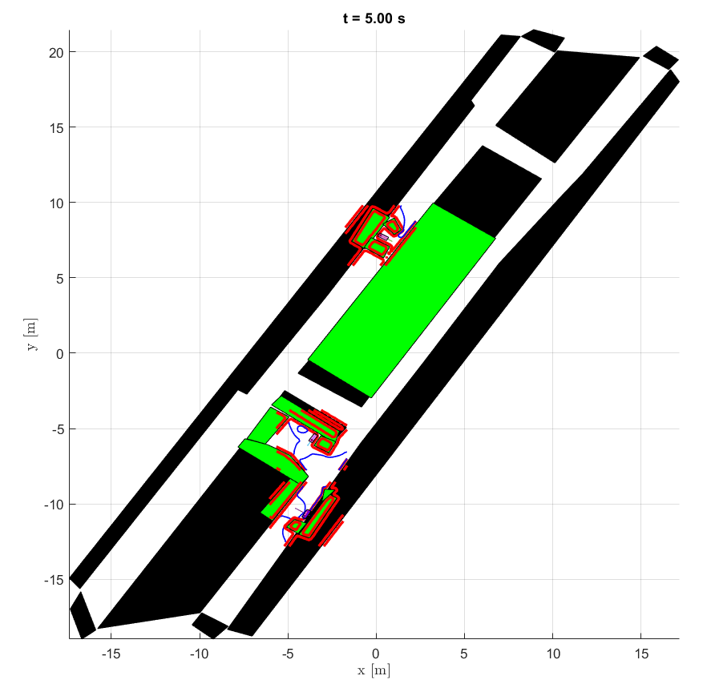

# parking-reachability

MATLAB scripts for reachability analysis, by EL2425-HT21 Team1.

## Dependencies

Add the path of these libraries in MATLAB.

[ToolboxLS](https://www.cs.ubc.ca/~mitchell/ToolboxLS/)

[helperOC](https://github.com/HJReachability/helperOC
) 

[YAMLMatlab](https://code.google.com/archive/p/yamlmatlab/downloads) (0.4.3)

## Results

